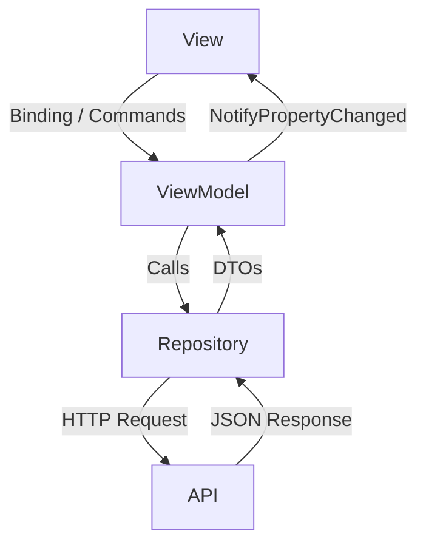

# 01 Architektura Frontendu

Tento soubor popisuje základní stavební kameny klientské aplikace `CtrlPay.Avalonia`. Architektura je navržena jako modulární a podporuje více platforem (Desktop, Android, Browser). V tomto souboru se zaměříme na Desktop, konkrétněji Windows.

## Hlavní technologie
- **Avalonia UI**: Cross-platformní UI framework pro .NET.
- **CommunityToolkit.Mvvm**: Knihovna pro implementaci vzoru MVVM (Model-View-ViewModel).
- **ReactiveUI / Messaging**: Pro komunikaci mezi komponentami bez pevné vazby (využívá se `WeakReferenceMessenger`).

## Vzor MVVM (Model-View-ViewModel)
Aplikace striktně odděluje vzhled od logiky:
1. **Views** (`Views/` a `Windows/`): Definují vzhled pomocí XAML. Obsahují pouze kód nezbytný pro UI (tzv. Code-behind).
2. **ViewModels** (`ViewModels/` a `Pieces/ViewModels`): Obsahují logiku. Dědí z `ViewModelBase` (který využívá `ObservableObject`). Zde se zpracovávají příkazy (`RelayCommand`) a drží se data pro zobrazení.
3. **Models / DTOs**: Data přicházející z `CtrlPay.Repos`.

### Diagram toku dat:


## Inicializace a Start Aplikace (`App.axaml.cs`)
Při spuštění aplikace probíhá rozhodovací proces, který určuje, jaké okno se uživateli zobrazí. Tento proces závisí na souboru `settings.json`.

```csharp
public override void OnFrameworkInitializationCompleted()
{
    if (ApplicationLifetime is IClassicDesktopStyleApplicationLifetime desktop)
    {
        if (IsConfigured) // Máme nastavené API a jazyk?
        {
            desktop.MainWindow = new LoginWindow();
        }
        else
        {
            // Pokud ne, spustíme průvodce nastavením
            desktop.MainWindow = new OnboardingWindow { DataContext = new OnboardingViewModel() };
        }
    }
}
```

## Životní cyklus a Onboarding (První spuštění)
Aplikace je navržena tak, aby byla po stažení ihned použitelná bez složité ruční editace konfiguračních souborů. Při startu probíhá kontrola existence lokálního nastavení (`settings.json`) přes `SettingsManager`:

1. **Stav: Neexistuje konfigurace** -> Spustí se `OnboardingWindow`. Uživatel zadá URL adresu API a základní preference. Data se uloží.
2. **Stav: Konfigurace existuje** -> Proběhne inicializace `Credentials.BaseUri` a aplikace rovnou zobrazí `LoginWindow`.

## Navigace a Role-based UI
Aplikace využívá dynamickou navigaci v rámci `MainView` pomocí `MainViewModel`. Obsah se mění podle role přihlášeného uživatele (Customer, Accountant, Admin, Employee).

- **Role-based Menu**: Navigační položky jsou generovány v `MainViewModel.GenerateNavItems()` na základě role z `Credentials.Role`.
- **NavItem**: Každá položka menu drží referenci na konkrétní `UserControl` (View) a ikonu.
- **Dynamic Content**: Výběr položky v menu aktualizuje vlastnost `CurrentPage`, která je nabindovaná na hlavní `ContentControl` v `MainView`.

## Modulární UI (Pieces)
Pro zvýšení znovupoužitelnosti kódu dělíme UI na menší části – **Pieces** (složka `Pieces/`).
- Každý "Piece" je samostatná komponenta (např. `TransactionListPiece`, `CounterPiece`).
- Tyto komponenty mají své vlastní ViewModely, což umožňuje jejich snadné vkládání do různých částí aplikace bez duplikace logiky.

## Synchronizace a vzory
Aby aplikace zůstala svižná a konzistentní, využívá dva důležité mechanismy:

### 1. UpdateHandler (Globální události)
Protože v aplikaci může být otevřeno více oken nebo pohledů najednou, používáme `UpdateHandler` pro synchronizaci dat. 
- Když se například v jednom okně změní uživatel, zavolá se `UpdateHandler.HandleUpdatedAdminUsers()`.
- Všechny ostatní komponenty, které toto téma zajímá (např. `AdminViewModel`), mají zaregistrovaný callback a automaticky si refreshnou data z repozitáře.

### 2. Vzor IEditableObject (Bezpečné úpravy)
Všechna hlavní DTOčka (např. `FrontendUserDTO`) implementují rozhraní `IEditableObject`. To umožňuje:
- **BeginEdit()**: Vytvoří se záložní kopie objektu.
- **CancelEdit()**: Pokud uživatel klikne na "Zrušit", objekt se automaticky vrátí do původního stavu.
- **EndEdit()**: Potvrdí změny a uvolní zálohu.
Díky tomu nemusíme ručně hlídat původní hodnoty v každém ViewModelu zvlášť.

## Klíčové manažery
- **SettingsManager**: Stará se o ukládání a načítání lokální konfigurace (`settings.json`).
- **TranslationManager**: Zajišťuje lokalizaci textů za běhu aplikace.
- **ThemeManager**: Spravuje barevná témata aplikace (např. Lime, Blue, Purple atd.) načítáním příslušných `.axaml` stylů.
