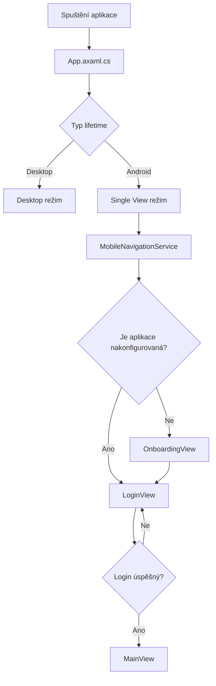

# Android 

Tento dokument popisuje vše co souvisí s Android frontend. 

---

## Balíčky 

- Avalonia framework
- .NET SDK - vše, co potřebujete k vytváření a spouštění .NET aplikací
- .NET Android workload - umožňuje .NET aplikaci běžet na Androidu
- Android SDK - oficiální Android vývojový balík
- Android Emulator - Virtuální telefon

## Spuštění aplikace

Android aplikace je hostována v projektu:

`CtrlPay.Avalonia.Android`

Vstupním bodem aplikace je soubor:

`MainActivity.cs`

Tento soubor inicializuje Avalonia aplikaci a spouští sdílený frontend projekt:

`CtrlPay.Avalonia`

Samotná logika aplikace je tedy sdílena mezi desktop verzí a Android verzí.

## Diagram - spouštění

## Logika

Logika aplikace je téměř totožná s desktop verzí jediným rozdílem že Avalonia na Androidu nepoužívá okna, ale jedno "root" view neboli "Single View režim"

Je implementována ve složce:

`CtrlPay.Avalonia/ViewModels`

## Single View režim

Android verze používá tzv. **Single View režim**.

To znamená, že aplikace má pouze jednu hlavní view (`MainView`), ve které se přepíná obsah jednotlivých obrazovek.

Na rozdíl od desktop verze se tedy neotevírají nová okna, ale pouze se mění aktuální view uvnitř této hlavní obrazovky.

## Views - Design

Design používá jednodušší layout než desktop. Místo více sloupců nebo samostatných oken se obsah skládá převážně vertikálně pod sebe

## Seznam aktuálních views

### Zákazník:
| View | Popis |
|-----|-----|
| **MobileLoginView** | Slouží pro přihlášení uživatele také možnost otevřít nastavení API. |
| **MobileMainView** | Funguje jako hlavní kontejner aplikace. Obsahuje navigaci a zobrazuje aktuálně zvolenou stránku. |
| **MobileDashboardView** | Zobrazuje základní přehled informací, například souhrny nebo poslední položky. |
| **MobileDebtView** | Slouží pro práci s dluhy. Obsahuje vyhledávání, filtrování a seznam jednotlivých položek. |
| **MobileTransactionView** | Zobrazuje přehled transakcí. |
| **MobileSettingsView** | Obsahuje nastavení aplikace, například jazyk, vzhled nebo API připojení. |

### Učetní má navíc:
| View | Popis |
|-----|-----|
| **MobileAPIConnectView** | nastavení API z přihlášení nebo onboardingu. **ViewModel:** `APIConnectViewModel`. |
| **MobileAccountantDashboardView** | Dashboard pro roli účetní: dlaždice (`DashboardTile`) a grafy zobrazující přehled příjmů a stavů plateb. **ViewModel:** `AccountantDashboardViewModel`. |
| **MobileCustomersListView** | Seznam zákazníků: vyhledávání, tlačítko pro přidání zákazníka a seznam zákaznických záznamů. |
| **MobilePaymentManagementView** | Správa plateb: vyhledávání, řazení, filtr stavu, tlačítko Přidat, seznam plateb a detail vybrané platby s možností úprav. **ViewModel:** `PaymentManagementViewModel`. |
| **MobileAccountantTransactionsView** | Přehled transakcí účetního: vyhledávání, filtry (zákazník, stav), přepínač zobrazení a seznam transakcí. **ViewModel:** `AccountantTransactionsViewModel`. |

## Navigace v aplikaci

Navigace v mobilní aplikaci je řízena pomocí `MobileNavigationService`.  

## Role uživatelů

Aplikace podporuje více typů uživatelů.  
Podle role se může měnit dostupná funkcionalita nebo navigace.

Role v aplikaci:

- Customer
- Accountant
- Admin

