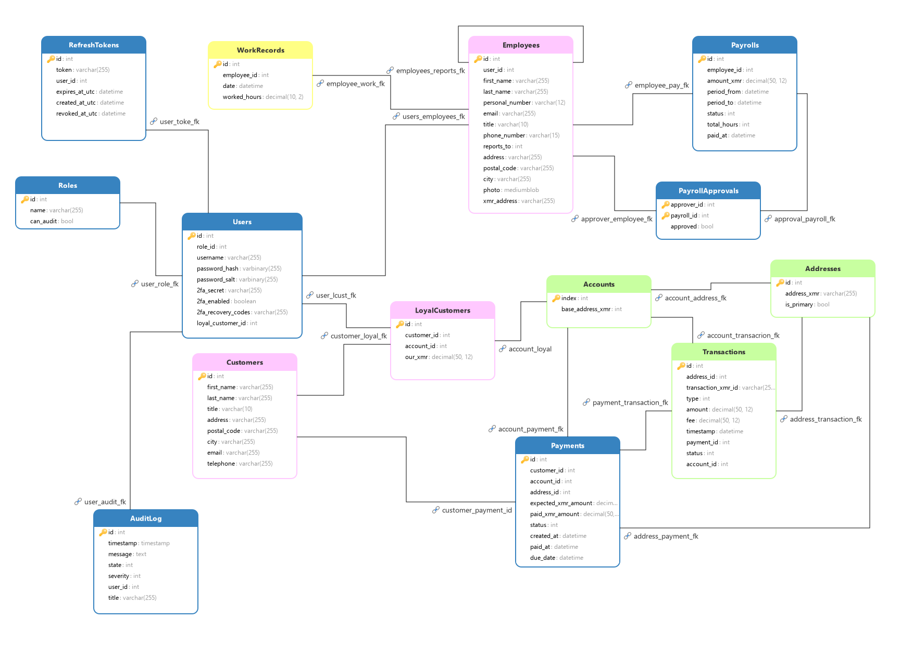

Diagram

Do databáze ukládáme všechna data se kterými naše aplikace pracuje. Pomocí Backround procesů z api se sem skrz Core a XMR projekty synchronizuje stav monero peněženky. Hlavními entitami jsou Payments - platby, kolem těch se všechno točí a zákazníci. Původní plán byl evidovat ještě zaměstnance a vyplácet je v Moneru, ale to se nestihlo.